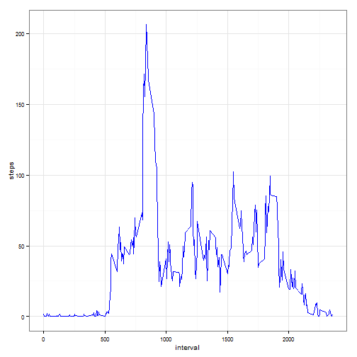

## Loading and preprocessing the data

### Load the data


```r
setAs("character","myDate", function(from) as.Date(from, format="%Y-%m-%d") )
activity=read.csv(unz("activity.zip", "activity.csv"), header=TRUE, colClasses=c("numeric","myDate","numeric"))
activityWithoutNA=na.omit(activity)
```

## What is mean total number of steps taken per day?

*missing values in activity dataset are ignored*

### Calculate the total number of steps taken per day


```r
sumSteps = aggregate(activity$steps, list(date=activity$date), FUN=sum)
summary(sumSteps)
```

```
##       date                  x        
##  Min.   :2012-10-01   Min.   :   41  
##  1st Qu.:2012-10-16   1st Qu.: 8841  
##  Median :2012-10-31   Median :10765  
##  Mean   :2012-10-31   Mean   :10766  
##  3rd Qu.:2012-11-15   3rd Qu.:13294  
##  Max.   :2012-11-30   Max.   :21194  
##                       NA's   :8
```

### Histogram of the total number of steps taken each day


```r
library("ggplot2")
g = ggplot(activity, aes(x=date,y=steps))
g + geom_histogram(stat="identity")+ylab("steps")
```

 


```r
sumMean=mean(sumSteps$x,na.rm=TRUE)
sumMedian=median(sumSteps$x,na.rm=TRUE)
```

### The mean and median of the total number of steps taken per day 

The mean of the total number of steps taken per day is **10766.19**
and the median of the total number of steps taken per day **10765.00**

## What is the average daily activity pattern?

### Time series plot (i.e. type = "l") of the 5-minute interval (x-axis) and the average number of steps taken, averaged across all days (y-axis)


```r
meanSteps = aggregate(activityWithoutNA$steps, list(interval=activityWithoutNA$interval), FUN=mean)
ggplot( data = meanSteps, aes( interval, x )) + geom_line() +ylab("steps")
```

 
    

```r
maxMeans=meanSteps[which.max(meanSteps[,2]),1]
```

### the 5-minutes interval having the maximum number of steps

**835** is the 5-minute interval containing the maximum number of steps


## Imputing missing values

Note that there are a number of days/intervals where there are missing values (coded as NA). The presence of missing days may introduce bias into some calculations or summaries of the data.

### Total missing values


```r
totalMissing=sum(!complete.cases(activity$steps))
```
The total number of missing values in the dataset (i.e. the total number of rows with NAs) is **2304**

### Filling missing values

*The strategy for filling in all of the missing values is to fill all the missing values with the mean for that 5-minute interval*

Creation a new dataset that is equal to the original dataset but with the missing data filled in.


```r
meanAll = mean(meanSteps$x,na.rm=TRUE)
meanSteps$x = mapply(function(x) ifelse(is.na(x), meanAll, x),meanSteps$x)
activity1=merge(activity,meanSteps,by="interval")
activity1=dplyr::mutate(activity1,steps=ifelse(is.na(steps), x, steps))
activity1=activity1[,!(names(activity1) %in% c("x"))]
```

### Histogram of the total number of steps taken each day


```r
meanSteps1 = aggregate(activity1$steps, list(date=activity1$date), FUN=mean)
ggplot(activity1, aes(x=date,y=steps))+ geom_histogram(stat="identity")+ylab("steps")
```

 
    
### Calculation and report of the mean and median total number of steps taken per day. 
    

```r
sumSteps1 = aggregate(activity1$steps, list(date=activity1$date), FUN=sum)
sumMean1=mean(sumSteps1$x)
sumMedian1=median(sumSteps1$x)
```

Mean of the total number of steps taken per day : **10766.19**

Median of the total number of steps taken per day : **10766.19**


Do these values differ from the estimates from the first part of the assignment? What is the impact of imputing missing data on the estimates of the total daily number of steps?

Median with filled null values equals **10766.19** and Median ignoring null values equals **10765.00**

Mean with filled null values equals **10766.19** and Mean ignoring null values equals **10766.19**


As expected there is no difference with the mean as null values where replaced with mean values, median values have changed, when null values are filled with mean values the median equals the mean.


## Are there differences in activity patterns between weekdays and weekends?

*We use the dataset with the filled-in missing values*

### Creation of a new factor variable in the dataset with two levels - "weekday" and "weekend" indicating whether a given date is a weekday or weekend day.


```r
library("dplyr")
activity1=dplyr::mutate(activity1,daytype=ifelse(weekdays(date)=="Sunday"|weekdays(date)=="Saturday", "weekend","weekday"))
meanSteps2WE = aggregate(steps~interval,data=subset(activity1,activity1$daytype=="weekend"), FUN=mean)
meanSteps2WD = aggregate(steps~interval,data=subset(activity1,activity1$daytype=="weekday"), FUN=mean)
```

### Panel plot containing a time series plot (i.e. type = "l") of the 5-minute interval (x-axis) and the average number of steps taken, averaged across all weekday days or weekend days (y-axis)


```r
library("gridExtra")
```

```
## Loading required package: grid
```

```r
gwe = ggplot( data = meanSteps2WE, aes( interval, steps )) + geom_line() +ylab("steps on weekdays")
gwd = ggplot( data = meanSteps2WD, aes( interval, steps )) + geom_line() +ylab("steps on weekends")
grid.arrange(gwd, gwe, ncol=2)
```

 
